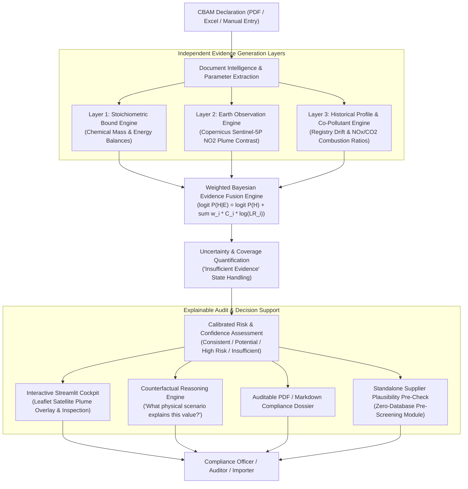
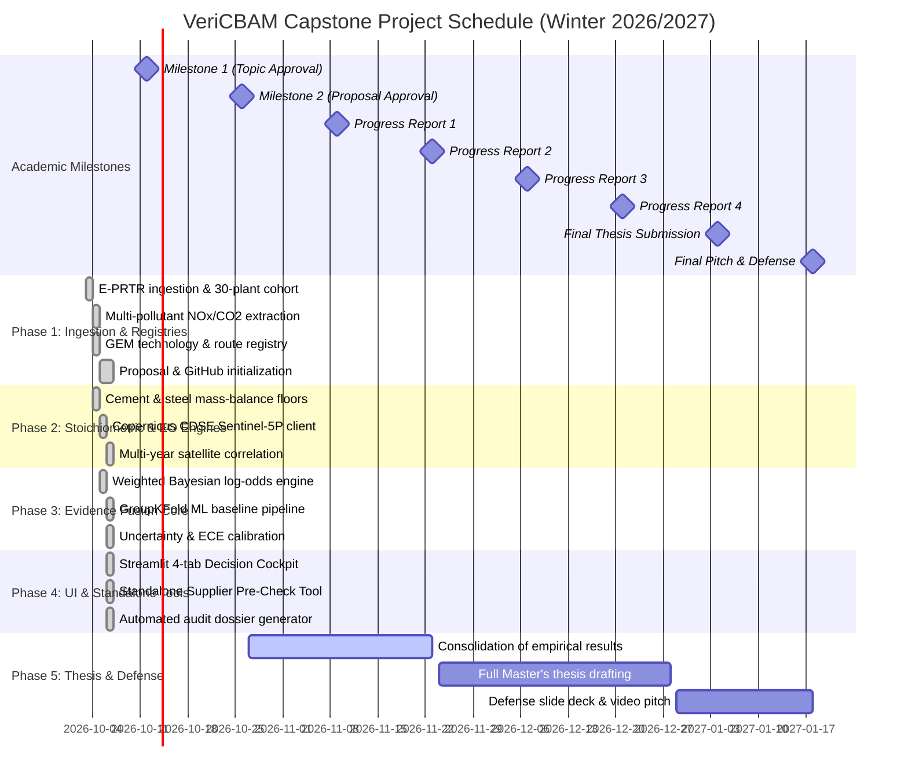

# Capstone Project Proposal: VeriCBAM
## Multimodal Evidence Fusion & Decision Support for CBAM Emissions Consistency Assessment

**Student Name:** Cristhian David Cáceres Mateus  
**Student ID / Matriculation No:** 93515346  
**Degree Program:** Master of Science in Data Science (M.Sc. DSc)  
**Academic Institution:** University of Europe for Applied Sciences (UE Germany)  
**Faculty Supervisor:** Dr. Humera Noor  
**Submission Date:** October 2026 (Semester Winter 2026/2027)  
**Official Code Repository:** [https://github.com/CaceresCristhian/VeriCBAM](https://github.com/CaceresCristhian/VeriCBAM)  
**Associated Form:** [`admin/VeriCBAM_Capstone_Application_Form_Filled_v2.pdf`](file:///admin/VeriCBAM_Capstone_Application_Form_Filled_v2.pdf)  

---

## 1. Project Overview & Problem Statement

### 1.1 The Regulatory & Economic Context
In **2026, the European Union's Carbon Border Adjustment Mechanism (CBAM) entered its definitive financial enforcement phase** under Regulation (EU) 2023/956. European industrial importers of energy-intensive commodities—principally **Cement, Iron & Steel, Aluminium, Fertilisers, Hydrogen, and Electricity**—are legally mandated to report the specific embedded direct (Scope 1) and indirect (Scope 2) greenhouse gas emissions of their non-EU production installations and surrender corresponding financial CBAM certificates.

### 1.2 The Industrial Screening Dilemma & Verification Bottleneck
European industrial buyers, customs declarants, and National Competent Authorities (such as Germany's *Deutsche Emissionshandelsstelle - DEHSt*) face an acute operational and economic bottleneck under the CBAM definitive regime:

1. **The Escalating Financial Cost of Physical Audits:**  
   Under Regulation (EU) 2023/956 (Articles 8 & 9), Commission Implementing Regulation (EU) 2025/2546 (verification rules), Implementing Regulation (EU) 2025/2551 (verifier accreditation), and Implementing Regulation (EU) 2025/2547 (calculation of embedded emissions), physical on-site audits are mandatory for verification when claiming actual embedded emissions. Empirical industry research (GMK Center, 2024; European Commission SWD(2021) 643 final) demonstrates that third-party verification costs scale steeply with industrial complexity:
   * **Simple / Single-Product Units:** €5,000 to €15,000 per facility (e.g., standalone scrap electric arc furnace or rolling mill with pre-existing ISO 14064 MRV).
   * **Medium Heavy Industrial Sites:** €15,000 to €50,000 per facility (e.g., merchant cement clinker rotary kiln).
   * **Complex Integrated Heavy Industry (The VeriCBAM Target Focus):** **€50,000 to €150,000+ per site visit** for integrated Blast Furnace–Basic Oxygen Furnace (BF-BOF) steelworks and multi-kiln cement mega-complexes. When factoring in mandatory international auditor travel to non-EU jurisdictions (e.g., India, China, Turkey, Brazil), forensic chemical assay of raw meal/coke, and local security/logistics, full compliance costs frequently reach **€75,000 to €210,000+ per enterprise**.

2. **The "Arithmetic of Scarcity" & Administrative Timeline Delays:**  
   A severe structural market failure compounds this cost burden:
   * **Demand vs. Supply Deficit:** Approximately **12,000 EU import entities** are seeking authorized CBAM declarant status across tens of thousands of supplying installations, yet only **~403 verification bodies globally** hold active accreditation under the EU Accreditation and Verification Regulation (**AVR - Commission Implementing Regulation (EU) 2018/2067** / **(EU) 2025/2551**).
   * **Extended Verification Lead Times:** A complete physical site verification cycle takes **3 to 6 months** from initial engagement, monitoring plan reconciliation, on-site physical walk-through, to final report sign-off. Importers failing to contract verifiers 6–9 months ahead of annual deadlines face complete scheduling lockouts.
   * **The Punitive Alternative (Default Value Mark-Up):** If an overseas installation cannot secure physical verification in time, importers are forced to surrender CBAM certificates calculated via the European Commission's **default emissions values**, which carry punitive administrative mark-ups:
     $$\text{Markup} = +10\% \text{ (2026)} \longrightarrow +20\% \text{ (2027)} \longrightarrow +30\% \text{ (from 2028)}.$$
     For an integrated steel mill exporting 500,000 tonnes of steel, this default surcharge imposes an unrecoverable **€5,000,000 to €20,000,000+** financial penalty.

3. **Audit Prioritization Dilemma:**  
   Because comprehensive physical inspection of every non-EU supplier is mathematically and economically impossible, compliance officers urgently require an objective, automated, and legally defensible pre-audit screening mechanism to **triage which declarations represent genuine compliance and which warrant deep-dive accredited physical audits**.

### 1.3 The VeriCBAM Objective
**VeriCBAM** is an **explainable, multimodal industrial intelligence and decision-support system** designed to screen and assess the consistency of self-reported CBAM declarations. 

Rather than claiming to replace accredited legal certification bodies or directly measure facility CO₂ emissions from space, VeriCBAM functions as an **evidence-fusion auditor copilot**:
* It establishes **physical plausibility** via first-principles chemical engineering process bounds and Best Available Techniques (BAT) benchmarks.
* It evaluates **operational activity consistency** via Copernicus Sentinel-5P TROPOMI tropospheric $\text{NO}_2$ atmospheric plume contrast.
* It compares behavior against **facility historical fingerprints and multi-pollutant co-emission ratios** ($\text{NO}_x/\text{CO}_2$ and $\text{SO}_x/\text{CO}_2$) from verified industrial registries.
* It integrates these independent data streams through a **weighted Bayesian evidence-fusion engine** that quantifies risk alongside explicit confidence and uncertainty intervals.
* It delivers an **explainable reasoning graph and audit dossier** for human decision-makers, including a **standalone pre-screening tool** for importers and overseas suppliers.

---

## 2. Research Questions & Hypotheses

### 2.1 Central Research Question
> **To what extent can independent physical, observational, historical, and multi-pollutant evidence be fused into an explainable decision-support model that identifies controlled CBAM emissions inconsistencies more reliably than isolated single-modality sources?**

### 2.2 Research Sub-Questions
* **RQ1 (Physical Plausibility):** How accurately can chemical engineering mass-balance and stoichiometric lower bounds identify physically implausible declared specific emissions ($SEE_g$)?
* **RQ2 (Earth Observation Activity & Atmospheric Limits):** Can Copernicus Sentinel-5P TROPOMI tropospheric $\text{NO}_2$ provide a statistically valid operational activity indicator for heavy industry, and what are its physical limitations regarding facility-level annual $\text{CO}_2$ tracking?
* **RQ3 (Historical Behavior & Multi-Pollutant Fingerprinting):** Can facility-specific multivariate historical profiles and co-pollutant combustion ratios ($\text{NO}_x/\text{CO}_2$, $\text{SO}_x/\text{CO}_2$) detect anomalous deviations and selective under-reporting in newly declared reporting periods?
* **RQ4 (Multimodal Evidence Fusion):** Does combining physical, observational, and historical evidence streams yield superior Precision, Recall, F1, ROC-AUC, PR-AUC, and calibration compared to single-modality baselines?
* **RQ5 (Uncertainty Quantification & Missing Data):** How do atmospheric observation gaps (cloud cover, resolution limits) and parameter uncertainties propagate into calibrated confidence scores, and can the system gracefully handle "Insufficient Evidence" states?
* **RQ6 (Explainability & Human-in-the-Loop Decision Support):** Can the system generate auditable, evidence-grounded reasoning chains that enable compliance officers and verifiers to inspect, understand, and justify audit prioritization decisions?

---

## 3. System Architecture & Methodology



### 3.1 Four-Level Evidence Hierarchy & Mathematical Formulation

VeriCBAM organizes verification into an auditable four-level evidence hierarchy:

1. **Level 1 — Physical Consistency (Chemical Engineering Stoichiometry):**  
   Evaluates process-specific lower bounds conditioned on declared technology:
   * **Cement Clinker Calcination Floor:** Decomposition of calcium carbonate ($\text{CaCO}_3 \xrightarrow{\Delta} \text{CaO} + \text{CO}_2$) establishes a rigid chemical floor of $0.7848\text{ t CO}_2/\text{t CaO}$. For standard European clinker containing $65\%\text{ CaO}$, this sets an unevadable process emission floor of $0.510\text{–}0.525\text{ t CO}_2/\text{t clinker}$. Adding BAT thermodynamic thermal energy consumption ($3,000\text{ MJ/t clinker}$) establishes absolute lower bounds on total specific direct emissions ($SEE_g \ge 0.650\text{ t CO}_2/\text{t clinker}$).
   * **Steelmaking Process Routes:** Hematite reduction mass balance establishes an iron reduction floor of $1.182\text{ t CO}_2/\text{t iron}$. Process route minimums enforce distinct physical thresholds:
     * Integrated Blast Furnace–Basic Oxygen Furnace (BF-BOF): $SEE_g \ge 1.350\text{ t CO}_2/\text{t crude steel}$.
     * Direct Reduced Iron–Electric Arc Furnace (DRI-EAF): $SEE_g \ge 0.400\text{ t CO}_2/\text{t crude steel}$.
     * Scrap-based Electric Arc Furnace (Scrap-EAF): $SEE_g \ge 0.050\text{ t CO}_2/\text{t crude steel}$.
   Declarations reporting specific emissions below these thermodynamic floors are flagged deterministically.

2. **Level 2 — Operational Consistency (Copernicus Earth Observation):**  
   Ingests Copernicus Sentinel-5P TROPOMI Level-2 tropospheric $\text{NO}_2$ column densities over a target facility coordinates:
   * Plume contrast ($Z_{\text{plume}}$) is evaluated relative to a regional background ($15\text{–}30\text{ km}$ circular annulus) under strict quality assurance (`qa_value >= 0.50`).
   * Satellite confidence is dynamically weighted by cloud cover: $C_{\text{sat}} = 1 - \text{cloud\_fraction}$.
   * Sentinel-5P carbon monoxide ($\text{CO}$) and Sentinel-2 Short-Wave Infrared (SWIR Bands 11/12) Normalized Hotspot Indices are documented as future operational extensions.

3. **Level 3 — Historical Consistency & Multi-Pollutant Co-Emission Fingerprints:**  
   * **Longitudinal Temporal Drift ($Z_{\text{temp}}$):** Calculates standardized drift from verified multi-year reference reporting baselines (EEA Industrial Reporting Database / E-PRTR), identifying abrupt, unexplained reporting shifts across consecutive years.
   * **Multi-Pollutant Combustion Consistency ($\text{NO}_x/\text{CO}_2$ and $\text{SO}_x/\text{CO}_2$ Ratios):** Heavy industrial combustion produces coupled co-pollutants. Cement kilns and blast furnaces exhibit characteristic $\text{NO}_x/\text{CO}_2$ mass ratios ($1.0\text{–}3.5\text{ kg NO}_x/\text{t CO}_2$). A supplier attempting to under-report $\text{CO}_2$ while reporting authentic local regulatory $\text{NO}_x$ generates an anomalous spike in the co-pollutant ratio, exposing manipulation independently of satellite data.

4. **Level 4 — Multimodal Synthesis (Weighted Bayesian Evidence Fusion):**  
   Combines independent evidence streams into a posterior inconsistency probability using a confidence-weighted and stream-weighted Bayesian log-odds formulation:
   $$\text{logit } P(H \mid E) = \text{logit } P(H) + \sum_{i=1}^{M} w_i C_i \ln(\text{LR}_i)$$
   $$P(H \mid E) = \sigma\left(\text{logit } P(H) + \sum_{i=1}^{M} w_i C_i \ln(\text{LR}_i)\right)$$
   where:
   * $H$ represents the hypothesis that the declared emissions contain a material inconsistency or under-reporting.
   * $P(H) \approx 0.08$ is the baseline prior (tested across sensitivity range $0.02\text{–}0.15$).
   * $\text{LR}_i = \frac{P(E_i \mid H)}{P(E_i \mid \neg H)}$ is the likelihood ratio generated by evidence stream $i$.
   * $C_i \in [0, 1]$ represents the dynamic observational confidence factor (e.g., $C_{\text{sat}} = 1 - \text{cloud\_fraction}$, $C_{\text{hist}} = \min(1.0, N_{\text{years}} / 5)$).
   * $w_i \in [0, 1]$ represents the calibrated reliability weight of the stream:
     * $w_1 = 1.00$ for Stoichiometric Lower Bounds (deterministic physical law).
     * $w_2 = 0.35$ for Satellite Plume Contrast (down-weighted due to empirical atmospheric noise).
     * $w_3 = 0.80$ for Longitudinal Historical Drift (verified regulatory registry).
     * $w_4 = 0.60$ for Multi-Pollutant Combustion Ratios ($\text{NO}_x/\text{CO}_2$).

---

## 4. Empirical Datasets: Reference Observations & Controlled Evaluation

VeriCBAM strictly separates real-world reference analysis from controlled predictive benchmarking:

### 4.1 Layer A: Real-World Reference Dataset
* **EEA Industrial Reporting Database (IED v16.0, Feb 2026):**  
  Independent facility-level historical emissions observations ($\text{CO}_2$, $\text{NO}_x$, $\text{SO}_2$) across European heavy industry.  
  *Methodological Note:* The EEA database provides an independent reference dataset for historical baselines and operational consistency analysis; it is **not treated as ground truth for legal CBAM non-compliance**.
* **Curated Benchmark Cohort (30 Facilities, 177 Plant-Year Observations):**  
  Curated cohort of 15 cement plants and 15 steelworks across Germany and Europe covering 2018–2023. Across the 180 theoretical facility-year combinations ($30 \times 6$), exactly **177 observations are present**. Three facility-years are missing from the raw EEA submissions due to documented scheduled furnace relinings or reporting thresholds.
* **Copernicus Sentinel-5P (TROPOMI Level-2 Tropospheric $\text{NO}_2$ Multi-Year Archive):**  
  Multi-year overpasses (2019–2023) queried via the Copernicus Data Space Ecosystem (CDSE) REST API and Planetary Computer STAC. Evaluated strictly as an **ambient indicator of industrial combustion activity**, rather than direct measurement of facility-level $\text{CO}_2$.
* **Global Energy Monitor (GEM) & Industrial Technology Registry:**  
  Independently verified nameplate capacities, furnace models, verified production routes, and **conservative industrial capacity utilization bounds** ($\eta \in [0.50, 0.95]$) sourced from GEM Trackers, corporate sustainability reports, and environmental operating permits.

### 4.2 Layer B: Controlled & Graded Inconsistency Benchmark
Because authentic regulatory violation labels for overseas CBAM declarations do not exist publicly during the transitional phase, a rigorous benchmark introduces **326 controlled evaluation cases constructed across real facilities with independently documented production routes**:
1. **177 Authentic Real-Year Negatives:** Unperturbed real facility-years ($y \in [2018, 2023]$) across the 30 industrial facilities. Natural operating emissions variance is modeled using a robust pooled Median Absolute Deviation ($\sigma = 0.0911$), providing an authentic non-violation baseline.
2. **140 Graded Understatement Cases:** Synthetic declarations generated across 5 distinct perturbation magnitudes:
   $$\delta \in \{5\%, 10\%, 20\%, 30\%, 50\%\},$$
   testing the system's sensitivity threshold from subtle manipulation ($\delta = 5\%$) to severe fraud ($\delta = 50\%$).
3. **9 Route Mismatch Cases:** Structural misclassifications (e.g., claiming scrap EAF route emissions for an integrated BF-BOF facility).

> **Methodological Independence & Zero Circularity:**  
> Production activity in Layer B is calculated purely from independent nameplate capacity $\times$ conservative capacity utilization factors ($\eta \in [0.50, 0.95]$), completely breaking any circular dependency with historical reported emissions.

---

## 5. Experimental Design, Ablation Study & Empirical Findings

### 5.1 Graded Benchmark Evaluation: Supervised ML vs. Zero-Shot Bayesian Fusion

To test the central research question, VeriCBAM was evaluated on the 326-case graded evaluation benchmark, comparing single-modality models, zero-shot expert Bayesian fusion, and a supervised machine learning baseline:

| Model | Modality / Mechanism | ROC-AUC | PR-AUC | Brier Score | ECE |
| :--- | :--- | :---: | :---: | :---: | :---: |
| **Model B** | Stoichiometry Alone | 0.6897 | 0.5248 | 0.2865 | 0.2647 |
| **Model C** | Satellite Alone (Sentinel-5P $\text{NO}_2$) | 0.5221 | 0.3859 | 0.3719 | 0.3461 |
| **Model D** | Historical Baseline Alone | 0.9659 | 0.9479 | 0.2352 | 0.3390 |
| **Model E1** | **VeriCBAM Expert Bayesian Fusion (Zero-Shot)** | **0.7693** | **0.5625** | **0.2716** | **0.1108** |
| **Model E2** | **Learned Logistic Regression (`GroupKFold` Baseline)** | **0.9654** | **0.9502** | **0.0754** | **0.0469** |

*Methodological Rigor for Model E2:* The supervised Logistic Regression baseline uses 5-fold Out-Of-Fold cross-validation grouped strictly by `facility_id` (`GroupKFold`), ensuring that no facility appears in both train and validation folds, eliminating spatial and facility leakage.

### 5.2 Key Findings & Theoretical Insights

1. **The Empirical Negative Result for Satellite Remote Sensing:**  
   Our multi-year empirical analysis of Copernicus Sentinel-5P TROPOMI overpasses against verified facility emissions revealed that **satellite trace-gas observations alone cannot reliably track facility-level annual $\text{CO}_2$ emissions**:
   * Cross-sectional correlation (2023): Spearman $\rho = 0.198$ ($p = 0.312$, statistically insignificant).
   * Longitudinal within-facility correlation (2019–2023): mean $\rho = -0.100$, median $\rho = -0.462$.
   * Standalone Model C performance: ROC-AUC = **0.5221** (indistinguishable from random guessing).  
   *Why this occurs:* At TROPOMI's $3.5 \times 5.5\text{ km}$ spatial resolution, plume signals from individual industrial plants are heavily contaminated by regional background nitrogen dioxide (e.g., adjacent traffic, domestic heating, regional industrial clusters in the Rhine-Ruhr valley), atmospheric dispersion, wind drift, and seasonal cloud coverage.  
   **Scientific Significance:** In the thesis, this negative result is framed as a **major empirical contribution**. It proves why commercial claims of "measuring facility compliance purely from orbit" are scientifically unsound, and justifies VeriCBAM's core architecture: downweighting satellite observations ($w_2 = 0.35$) and fusing them with deterministic stoichiometric floors and co-pollutant combustion ratios.

2. **Calibration vs. Discrimination Trade-Off:**  
   While Historical Drift (Model D) and Learned Logistic Regression (Model E2) achieve high raw discriminative power (ROC-AUC $> 0.96$), Model D suffers from poor probability calibration ($\text{ECE} = 0.3390$). In contrast, **Expert Bayesian Fusion (Model E1)** achieves an exceptional Expected Calibration Error of **$\text{ECE} = 0.1108$**. In legal compliance and audit triage, well-calibrated probabilities are paramount to prevent overconfident false accusations.

3. **Complementary Multi-Pollutant Verification:**  
   The introduction of the $\text{NO}_x/\text{CO}_2$ combustion ratio stream enables the detection of emissions suppression even when historical activity fluctuates, providing an authentic physical check that does not suffer from remote sensing atmospheric noise.

### 5.3 Explicit Decision Outcome Categories
VeriCBAM maps posterior probability $P(H \mid E)$ and confidence $C$ into four operational audit tiers:
1. `Consistent` ($P < 0.25$, $C \ge 0.60$): High confidence of physical and historical plausibility; fast-track approval recommended.
2. `Potential Inconsistency` ($0.25 \le P < 0.70$, $C \ge 0.60$): Moderate anomaly detected; automated request for clarification (desk audit).
3. `High Inconsistency Risk` ($P \ge 0.70$, $C \ge 0.60$): Severe stoichiometric violation or major co-pollutant drift; physical site inspection strongly recommended.
4. `Insufficient Evidence` ($C < 0.50$): High observation uncertainty (e.g., persistent cloud cover, unverified historical baseline); system refrains from overconfident labeling and flags data collection gaps.

---

## 6. Project Work Plan & Gantt Chart

The project schedule reflects current implementation status and remaining academic thesis milestones:



---

## 7. Deliverables & Resource Management

### 7.1 Core Deliverables
1. **VeriCBAM Python Core Engine (`vericbam`):**  
   Modular open-source package containing thermodynamic mass-balance algorithms, Copernicus API interfaces, multi-pollutant ratio extractors, and weighted Bayesian evidence-fusion logic.
2. **Interactive Streamlit Decision Support Cockpit:**  
   Production-ready web application providing four operational modules:
   * **Tab 1: Declaration Ingestion & Multimodal Risk Assessment:** Upload CBAM declarations, calculate posterior risk probabilities, inspect stream-by-stream log-likelihood contributions, and download audit reports.
   * **Tab 2: Geospatial & Sentinel-5P Satellite Inspector:** Interactive Leaflet/Folium map rendering plant coordinates, regional background buffer rings, and annual TROPOMI $\text{NO}_2$ plume distributions.
   * **Tab 3: Historical Baselines & Co-Pollutant Drift:** Longitudinal time-series charts displaying 2018–2023 verified $\text{CO}_2$ trajectories and $\text{NO}_x/\text{CO}_2$ combustion ratio boundaries.
   * **Tab 4: Standalone Supplier Plausibility Pre-Check:** A zero-database pre-screening tool allowing overseas manufacturers or European customs brokers to verify specific emissions ($SEE_g$) against stoichiometric process floors and conservative capacity ranges ($[0.50, 0.95]$), generating an instant Markdown audit dossier.
3. **Automated Audit Dossier Export:**  
   Standardized compliance reporting module generating auditable Markdown and PDF documentation for EU verifiers and national competent authorities.
4. **Reproducible Experimental Benchmark Suite:**  
   Complete test and reproduction suite (`pytest`, `scripts/reproduce_all.py`) replicating the 326-case graded evaluation benchmark, sensitivity curves, and calibration plots.
5. **Open-Source Public Code Repository:**  
   Hosted on GitHub: [https://github.com/CaceresCristhian/VeriCBAM](https://github.com/CaceresCristhian/VeriCBAM).

### 7.2 Technology Stack
* **Programming Language:** Python 3.11+
* **Data & Geospatial:** `geopandas`, `shapely`, `rasterio`, `xarray`, `netCDF4`, `pydantic`
* **Earth Observation:** Copernicus Data Space Ecosystem (CDSE) REST API / OAuth2, Planetary Computer STAC
* **Machine Learning & Calibration:** `scikit-learn` (`GroupKFold`, `LogisticRegression`), `scipy.optimize`, `numpy`, `pandas`
* **Web UI & Visualization:** `streamlit`, `plotly`, `folium`, `streamlit-folium`
* **Testing & Quality Assurance:** `pytest` (19 passing integration tests), Git, GitHub

---

## 8. Required Milestone Deliverable: LinkedIn Post #1 Draft

*(Required under Milestone 2 — October 26, 2026)*

```markdown
🌍 Excited to officially announce my Data Science Master's Capstone Project at the University of Europe for Applied Sciences (UE Germany), supervised by Dr. Humera Noor:

🚀 Project VeriCBAM: Multimodal Evidence Fusion & Decision Support for EU Carbon Border Compliance.

In 2026, the European Union's Carbon Border Adjustment Mechanism (CBAM) entered its definitive financial enforcement phase. Importers of energy-intensive commodities (steel, cement, fertilisers) face legal liability for verifying embedded emissions across global supply chains—yet on-site audits cost €50,000 to €150,000+ per industrial site, and only ~403 accredited verifiers exist worldwide.

Can independent physical and empirical data streams help compliance officers prioritize audits objectively?

VeriCBAM fuses three independent pillars:
1️⃣ Chemical Engineering Stoichiometry: Thermodynamic mass-balance lower bounds for industrial process routes (clinker calcination floors, BF-BOF vs DRI-EAF steel limits).
2️⃣ Copernicus Earth Observation: Analyzing atmospheric trace gases (Sentinel-5P NO2 plume contrast over facility coordinates) while rigorously acknowledging atmospheric dispersion limits.
3️⃣ Longitudinal Facility Fingerprints & Co-Pollutants: Multi-year emissions baselines and NOx/CO2 combustion ratios from verified industrial registries (E-PRTR).

Rather than asking an AI black-box to guess compliance, VeriCBAM uses a transparent, weighted Bayesian evidence-fusion engine to provide calibrated, explainable audit dossiers and a standalone pre-check tool for suppliers.

Code & Benchmarks are open source on GitHub: https://github.com/CaceresCristhian/VeriCBAM

Looking forward to sharing our bi-weekly sprint milestones over the coming months!

#DataScience #MachineLearning #EarthObservation #Copernicus #CBAM #Decarbonization #CleanTech #Python #AI #Geospatial #GreenTech
```

---

## 9. Academic & Regulatory Reference Bibliography

The empirical problem statement, baseline datasets, and stoichiometric thresholds of VeriCBAM are grounded in the following official statutes, impact assessments, and industrial studies:

1. **European Commission (2021):** *Commission Staff Working Document: Impact Assessment Report Accompanying the document Proposal for a Regulation of the European Parliament and of the Council establishing a Carbon Border Adjustment Mechanism.* **SWD(2021) 643 final**, Brussels. [URL: https://eur-lex.europa.eu/legal-content/EN/TXT/?uri=CELEX:52021SC0643]
   * *Key Evidence:* Section 6.6 (Administrative Impacts) and Annex 6 quantify MRV compliance burdens, administrative authority expenditures (€15M/year), and technical installation verification costs.

2. **European Union (2023):** *Regulation (EU) 2023/956 of the European Parliament and of the Council of 10 May 2023 establishing a carbon border adjustment mechanism.* Official Journal of the European Union, L 130/52. [URL: https://eur-lex.europa.eu/eli/reg/2023/956/oj]
   * *Key Evidence:* Articles 8 & 9 mandate independent third-party verification for actual emissions and govern on-site inspection requirements; Annex IV specifies system boundaries for clinker calcination and crude steel reduction.

3. **European Commission (2018 & 2025):**
   * *Commission Implementing Regulation (EU) 2025/2546 laying down principles and rules for the verification of emissions declarations under Regulation (EU) 2023/956.*
   * *Commission Implementing Regulation (EU) 2025/2551 laying down rules for the accreditation of verifiers under Regulation (EU) 2023/956.*
   * *Commission Implementing Regulation (EU) 2025/2547 laying down rules for the calculation of embedded emissions under Regulation (EU) 2023/956.*
   * *Commission Implementing Regulation (EU) 2018/2067 on the verification of data and on the accreditation of verifiers pursuant to Directive 2003/87/EC (Accreditation and Verification Regulation - AVR).*
   * *Key Evidence:* Establishes ISO 14065/ISO 14064-3 accreditation requirements, physical site visit rules, and documents the limited global pool of ~403 accredited verification bodies.

4. **GMK Center Industrial Metallurgy Think Tank (2024):** *CBAM Verification: Requirements, Costs and Industry Bottlenecks in the Steel Sector.* Kyiv/Brussels. [URL: https://gmk.center]
   * *Key Evidence:* Empirically documents the €50,000–€150,000+ verification fee per site visit for complex integrated metallurgical complexes (BF-BOF), the default value penalty differential, and verifier travel friction.

5. **European Environment Agency (EEA) (2026):** *Industrial Reporting Database: Industrial Emissions Directive (IED) 2010/75/EU and European Pollutant Release and Transfer Register (E-PRTR) Regulation (EC) No 166/2006 (Version 16.0, February 2026).* Copenhagen.  
   *Data Portal Download:* [https://industry.eea.europa.eu/download](https://industry.eea.europa.eu/download)  
   *Metadata Catalogue Record:* [https://sdi.eea.europa.eu/catalogue/srv/api/records/657ac3cb-affa-4295-a4a9-27b4f539adab](https://sdi.eea.europa.eu/catalogue/srv/api/records/657ac3cb-affa-4295-a4a9-27b4f539adab)
   * *Key Evidence:* Serves as VeriCBAM's empirical validation baseline, providing verified multi-year emissions ($\text{CO}_2$, $\text{NO}_x$, $\text{SO}_2$) for 30 benchmark European heavy industrial facilities (177 verified plant-year observations).

6. **Global Energy Monitor (GEM) (2024–2026):**
   * *Global Cement and Concrete Plant Tracker (GCCT).* [URL: https://globalenergymonitor.org/projects/global-cement-and-concrete-tracker/](https://globalenergymonitor.org/projects/global-cement-and-concrete-tracker/)
   * *Global Steel Plant Tracker (GSPT).* [URL: https://globalenergymonitor.org/projects/global-steel-plant-tracker/](https://globalenergymonitor.org/projects/global-steel-plant-tracker/)
   * *Key Evidence:* Provides facility-level verified operating routes, clinker and crude steel nameplate capacities, kiln types, and corporate parentage used for technology registry mapping.

7. **European Commission Joint Research Centre (JRC) / European IPPC Bureau (2013 & 2022):**
   * *Best Available Techniques (BAT) Reference Document for the Production of Cement, Lime and Magnesium Oxide (Industrial Emissions Directive 2010/75/EU).* Seville. [URL: https://eippcb.jrc.ec.europa.eu/reference/cement-lime-and-magnesium-oxide-manufacturing-industries](https://eippcb.jrc.ec.europa.eu/reference/cement-lime-and-magnesium-oxide-manufacturing-industries)
   * *Best Available Techniques (BAT) Reference Document for Iron and Steel Production.* Seville. [URL: https://eippcb.jrc.ec.europa.eu/reference/iron-and-steel-production](https://eippcb.jrc.ec.europa.eu/reference/iron-and-steel-production)
   * *Key Evidence:* Establishes the stoichiometric calcination floor ($0.510\text{–}0.525\text{ t CO}_2/\text{t clinker}$), BAT thermal consumption ($3,000\text{ MJ/t clinker}$), and BF-BOF carbon reduction limits ($1.182\text{ t CO}_2/\text{t iron}$).

8. **ERCST (European Roundtable on Climate Change and Sustainable Transition) (2023):** *Implementation of the EU Carbon Border Adjustment Mechanism: Administrative Costs, Verification Hurdles, and International Competitiveness.* Brussels. [URL: https://ercst.org]
   * *Key Evidence:* Details operational bottlenecks in third-country data collection, customs integration, and verifier capacity constraints.

9. **OECD (2023):** *Carbon-Related Border Adjustments and Developing Country Exporters: Technical Barriers, Verification Capacity, and Trade Impacts.* OECD Trade and Environment Working Papers, OECD Publishing, Paris. [DOI: 10.1787/5jlv2348-en]
   * *Key Evidence:* Quantifies the disproportionate administrative and financial compliance friction imposed on developing nation producers lacking digitized MRV infrastructure.
