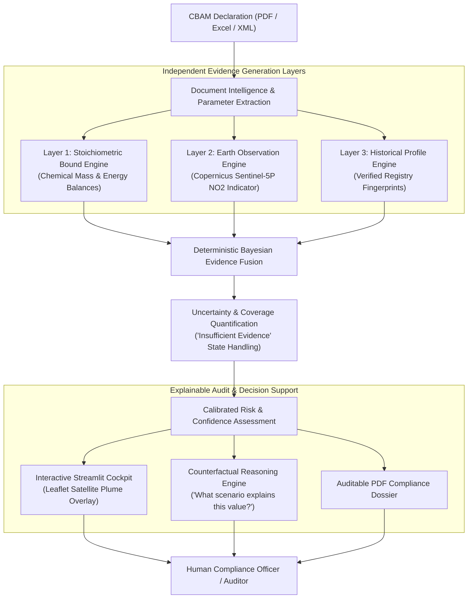
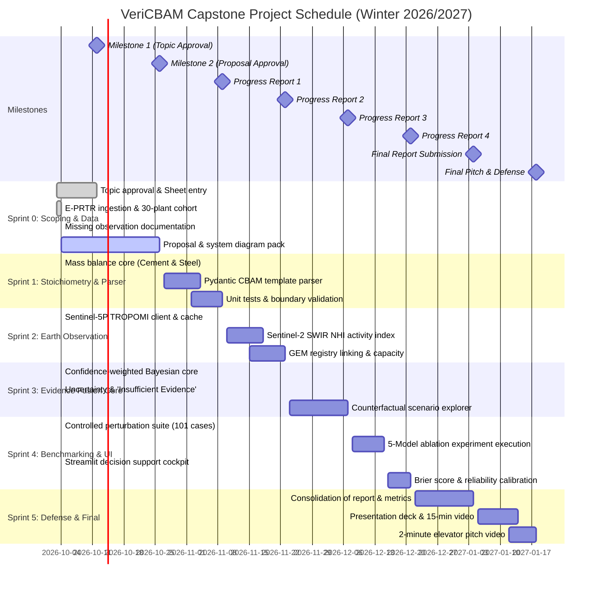

# Capstone Project Proposal: VeriCBAM
## Multimodal Evidence Fusion & Decision Support for CBAM Emissions Consistency Assessment

**Student Name:** Cristhian David Cáceres Mateus  
**Student ID / Matriculation No:** 93515346  
**Degree Program:** Master of Science in Data Science (M.Sc. DSc)  
**Academic Institution:** University of Europe for Applied Sciences (UE Germany)  
**Faculty Supervisor:** Dr. Humera Noor  
**Submission Date:** October 2026 (Semester Winter 2026/2027)  
**Associated Form:** [`admin/VeriCBAM_Capstone_Application_Form_Filled_v2.pdf`](file:///admin/VeriCBAM_Capstone_Application_Form_Filled_v2.pdf)  

---

## 1. Project Overview & Problem Statement

### 1.1 The Regulatory & Economic Context
In **2026, the European Union's Carbon Border Adjustment Mechanism (CBAM) entered its definitive financial enforcement phase** under Regulation (EU) 2023/956. European industrial importers of energy-intensive commodities—principally **Cement, Iron & Steel, Aluminium, Fertilisers, Hydrogen, and Electricity**—are legally mandated to report the specific embedded direct (Scope 1) and indirect (Scope 2) greenhouse gas emissions of their non-EU production installations and surrender corresponding financial CBAM certificates.

### 1.2 The Industrial Screening Dilemma & Verification Bottleneck
European industrial buyers, customs brokers, and National Competent Authorities (such as Germany's *DEHSt*) face an acute operational and economic bottleneck under the CBAM definitive regime:

1. **The Escalating Financial Cost of Physical Audits:**
   Under Regulation (EU) 2023/956 (Articles 8 & 9), Commission Implementing Regulation (EU) 2025/2546 (verification rules), Implementing Regulation (EU) 2025/2551 (verifier accreditation), and Implementing Regulation (EU) 2025/2547 (calculation of embedded emissions), physical on-site audits are mandatory for initial verification when claiming actual embedded emissions. Empirical industry research (GMK Center, 2024; European Commission SWD(2021) 643 final) demonstrates that third-party verification costs scale steeply with industrial complexity:
   * **Simple / Single-Product Units:** €5,000 to €15,000 per facility (e.g. standalone scrap EAF or rolling mill with pre-existing ISO 14064 MRV).
   * **Medium Heavy Industrial Sites:** €15,000 to €50,000 per facility (e.g. merchant cement clinker rotary kiln).
   * **Complex Integrated Heavy Industry (The VeriCBAM Target Focus):** **€50,000 to €150,000+ per site visit** for integrated Blast Furnace–Basic Oxygen Furnace (BF-BOF) steelworks and multi-kiln cement mega-complexes. When factoring in mandatory international auditor travel to non-EU jurisdictions (e.g. India, China, Turkey, Brazil), forensic chemical assay of raw meal/coke, and local security/logistics, full compliance costs frequently reach **€75,000 to €210,000+ per enterprise**.

2. **The "Arithmetic of Scarcity" & Administrative Timeline Delays:**
   A severe structural market failure compounds this cost burden:
   * **Demand vs. Supply Deficit:** Approximately **12,000 EU import entities** are seeking authorized CBAM declarant status across tens of thousands of supplying installations, yet only **~403 verification bodies globally** hold active accreditation under the EU Accreditation and Verification Regulation (**AVR - Commission Implementing Regulation (EU) 2018/2067** / **(EU) 2025/2551**).
   * **Extended Verification Lead Times:** A complete physical site verification cycle takes **3 to 6 months** from initial engagement, monitoring plan reconciliation, on-site physical walk-through, to final report sign-off. Importers failing to contract verifiers 6–9 months ahead of annual deadlines face complete scheduling lockouts.
   * **The Punitive Alternative (Default Value Mark-Up):**
     If an overseas installation cannot secure physical verification in time, importers are forced to surrender CBAM certificates calculated via the European Commission's **default emissions values**, which carry punitive administrative mark-ups:
     $$\text{Markup} = +10\% \text{ (2026)} \longrightarrow +20\% \text{ (2027)} \longrightarrow +30\% \text{ (from 2028)}.$$
     For an integrated steel mill exporting 500,000 tonnes of steel, this default surcharge imposes an unrecoverable **€5,000,000 to €20,000,000+** financial penalty.

3. **Audit Prioritization Dilemma:**
   Because comprehensive physical inspection of every non-EU supplier is mathematically and economically impossible, compliance officers urgently require an objective, automated, and legally defensible pre-audit screening mechanism to **triage which declarations represent genuine compliance and which warrant deep-dive accredited physical audits**.

### 1.3 The VeriCBAM Objective
**VeriCBAM** is an **explainable, multimodal industrial intelligence and decision-support system** designed to screen and assess the consistency of self-reported CBAM declarations. 

Rather than claiming to replace accredited legal certification bodies or directly measure facility CO₂ emissions from space, VeriCBAM functions as an **evidence-fusion auditor copilot**:
* It establishes **physical plausibility** via first-principles chemical engineering process bounds and BAT benchmarks.
* It evaluates **operational consistency** via Copernicus Sentinel-5P TROPOMI tropospheric $\text{NO}_2$ atmospheric activity anomalies (with Sentinel-5P $\text{CO}$ and Sentinel-2 SWIR designated as planned extensions).
* It compares behavior against **facility historical fingerprints** from verified industrial registries.
* It integrates these independent data streams through a **deterministic Bayesian evidence-fusion engine** that quantifies risk alongside explicit confidence and uncertainty intervals.
* It delivers an **explainable reasoning graph and audit dossier** for human decision-makers.

---

## 2. Research Questions & Hypotheses

### 2.1 Central Research Question
> **To what extent can independent physical, observational, historical, and documentary evidence be fused into an explainable decision-support model that identifies controlled CBAM emissions inconsistencies more reliably than isolated evidence sources?**

### 2.2 Research Sub-Questions
* **RQ1 (Physical Plausibility):** How accurately can chemical engineering mass-balance and stoichiometric lower bounds identify physically implausible declared specific emissions ($SEE_g$)?
* **RQ2 (Earth Observation Activity):** Can Copernicus Sentinel-5P TROPOMI tropospheric $\text{NO}_2$ provide a statistically valid operational activity indicator that correlates with reported industrial activity?
* **RQ3 (Historical Behavior & Fingerprinting):** Can facility-specific multivariate historical profiles (E-PRTR, production capacity, emissions intensity) detect anomalous deviations in newly declared reporting periods?
* **RQ4 (Multimodal Evidence Fusion):** Does combining physical, observational, and historical evidence streams yield superior Precision, Recall, F1, and False Positive Rates compared to single-modality baselines?
* **RQ5 (Uncertainty Quantification):** How do atmospheric observation gaps (cloud cover, resolution limits) and parameter uncertainties propagate into the final consistency confidence score?
* **RQ6 (Explainability & Human-in-the-Loop):** Can the system generate auditable, evidence-grounded reasoning chains that enable compliance officers to inspect, understand, and justify audit prioritization decisions?

---

## 3. System Architecture & Methodology



### 3.1 Four-Level Evidence Hierarchy & Core Subsystems

VeriCBAM organizes verification into an auditable four-level evidence hierarchy:

1. **Level 1 — Physical Consistency (Chemical Engineering Stoichiometry):**
   Evaluates process-specific lower bounds conditioned on declared technology (Cement clinker calcination: $\text{CaCO}_3 \xrightarrow{\Delta} \text{CaO} + \text{CO}_2$ yielding $0.7848\text{ t CO}_2/\text{t CaO}$ plus BAT thermal minimum $3,000\text{ MJ/t clinker}$; Steelmaking: hematite reduction mass balance yielding $1.182\text{ t CO}_2/\text{t iron}$ and route floors for BF-BOF vs. DRI-EAF vs. Scrap-EAF). Deterministically flags physical feasibility violations under model assumptions.
2. **Level 2 — Operational Consistency (Copernicus Earth Observation):**
   Ingests Sentinel-5P TROPOMI tropospheric $\text{NO}_2$ columns to evaluate combustion activity contrast ($Z_{\text{plume}}$) relative to regional background ($15\text{–}30\text{ km}$ annulus) under quality assurance filtering (`qa_value >= 0.50`). Sentinel-5P $\text{CO}$ and Sentinel-2 SWIR Bands 11/12 are specified as planned extensions.
3. **Level 3 — Historical Consistency (Longitudinal Facility Fingerprints):**
   Calculates statistical drift ($Z_{\text{temp}}$) from verified multi-year reference reporting baselines (EEA Industrial Reporting Database / E-PRTR), identifying abrupt, unexplained reporting shifts.
4. **Level 4 — Multimodal Synthesis (Calibrated Probabilistic Evidence Fusion):**
   Fuses independent physical, operational, and historical likelihood ratios using a confidence-weighted Bayesian log-odds formulation:
   $$\text{logit } P(H \mid E) = \text{logit } P(H) + \sum_{i} C_i \times \log(LR_i)$$
   $$P(H \mid E) = \sigma\left(\text{logit } P(H) + \sum_{i} C_i \log(LR_i)\right)$$
   where $H$ represents material inconsistency, $P(H) \approx 0.08$ is the baseline prior (tested across sensitivity range $0.02\text{–}0.15$), $LR_i = \frac{P(E_i \mid H)}{P(E_i \mid \neg H)}$ is the likelihood ratio from evidence stream $i$, and $C_i \in [0, 1]$ is the observational confidence factor (e.g. $C_{\text{sat}} = 1 - \text{cloud\_fraction}$).

---

## 4. Empirical Datasets: Reference Observations & Controlled Evaluation

VeriCBAM strictly separates real-world reference analysis from controlled predictive benchmarking:

### 4.1 Layer A: Real-World Reference Dataset
* **EEA Industrial Reporting Database (E-PRTR / IED v16.0, Feb 2026):**
  Independent facility-level historical emissions observations ($CO_2$, $NO_x$, $SO_2$) across European heavy industry.
  > *Methodological Note:* The EEA database provides an independent reference dataset for historical baselines and operational consistency analysis; it is **not treated as ground truth for legal CBAM non-compliance**.
* **Benchmark Cohort (30 Facilities, 177 Observations):**
  Curated cohort of 15 cement plants and 15 steelworks across Germany and Europe covering 2018–2023. Across the 180 theoretical facility-year combinations ($30 \times 6$), exactly **177 observations are present**. Three facility-years are missing from the raw EEA submissions due to documented scheduled relinings or reporting thresholds.
* **Copernicus Sentinel-5P (TROPOMI Level-2 Tropospheric $\text{NO}_2$):**
  Level-2 tropospheric $\text{NO}_2$ vertical column densities queried via Microsoft Planetary Computer STAC / Azure Blob Storage. Evaluated strictly as an **independent atmospheric indicator of industrial operational activity**, rather than direct measurement of facility-level $\text{CO}_2$ emissions. Sentinel-5P $\text{CO}$ and Sentinel-2 SWIR (Bands 11/12) are planned future extensions.
* **Global Energy Monitor (GEM) & Industrial Technology Registry:**
  Independently verified nameplate capacities, furnace models, verified production routes, and empirical capacity utilization factors ($\eta \in [0.35, 0.86]$) sourced from GEM Trackers, corporate reports, and environmental permits.

### 4.2 Layer B: Controlled Inconsistency Benchmark
Because authentic regulatory violation labels for overseas CBAM declarations do not exist publicly during the transitional phase, a separate benchmark introduces **controlled evaluation cases constructed across real facilities with independently documented production routes** (101 labeled cases: 30 unperturbed concordant baselines, 30 physical calcination/reduction violations, 30 abrupt historical drops, and 11 controlled route-mismatch cases).
> *Methodological Independence (Addressing Finding #4):* Production activity in Layer B is calculated purely from independent nameplate capacity $\times$ independent capacity utilization factors ($\eta$), completely breaking any circular dependency with historical reported emissions.

---

## 5. Experimental Design & 5-Model Ablation Study

To test the central hypothesis—*does multimodal evidence fusion improve the detection and calibration of known inconsistencies compared with individual evidence sources?*—VeriCBAM evaluates five distinct models across the controlled evaluation benchmark:

* **Model A (Declaration-Only Baseline):** Tabular outlier detection against regional sector averages.
* **Model B (Stoichiometry Alone):** Evaluates physical and chemical mass-balance constraints.
* **Model C (Satellite Alone):** Evaluates Sentinel-5P remote-sensing operational plume contrast ($Z_{\text{plume}}$).
* **Model D (Historical Alone):** Evaluates statistical deviations relative to historical facility fingerprints.
* **Model E (VeriCBAM Multimodal Fused):** **Confidence-weighted Bayesian fusion of Models B + C + D.**

**Evaluated Metrics (where controlled labels exist):** Precision, Recall, F1-Score, ROC-AUC, PR-AUC, Brier Score, and Expected Calibration Error (ECE).  
**Explicit Outcome Categories:**
1. `Consistent` (Low Risk $P < 0.25$, High Confidence $C \ge 0.60$)
2. `Potential Inconsistency` (Moderate Risk $0.25 \le P < 0.70$, High Confidence $C \ge 0.60$)
3. `High Inconsistency Risk` (High Risk $P \ge 0.70$, High Confidence $C \ge 0.60$)
4. `Insufficient Evidence` (Observational Confidence $C < 0.50$ due to persistent cloud cover or missing baselines).

---

## 6. Project Work Plan & Gantt Chart

The project schedule reflects current implementation status and remaining validation milestones:



---

## 7. Deliverables & Resource Management

### 7.1 Core Deliverables
1. **VeriCBAM Python Library:** Modular package containing stoichiometric engines, Copernicus API processors, and Bayesian fusion models.
2. **Interactive Streamlit Cockpit:** Web application allowing users to upload declaration files, inspect satellite plume visualizers, and review explainable risk scores.
3. **Automated Audit Dossier Export:** PDF reporting module generating evidence summaries suitable for compliance officers.
4. **Academic Evaluation Notebooks:** Fully reproducible Jupyter notebooks demonstrating the 5-model ablation benchmark against 30 verified E-PRTR installations.

### 7.2 Technology Stack
* **Core Language:** Python 3.11+
* **Data & Geospatial:** `geopandas`, `shapely`, `rasterio`, `xarray`, `netCDF4`, `pydantic`
* **Earth Observation:** Copernicus Data Space Ecosystem (CDSE) REST API, SentinelHub
* **Machine Learning & Stats:** `scikit-learn`, `scipy.optimize`, `numpy`, `pandas`
* **LLM & Reasoning:** `langchain`, `llama-index` (local Llama-3.3-70B via Groq/Ollama or OpenAI GPT-4o)
* **Web & Visualization:** `streamlit`, `plotly`, `folium` / `streamlit-folium`
* **Version Control & CI:** Git, GitHub Actions (`pytest`, `flake8`)

---

## 8. Required Milestone Deliverable: LinkedIn Post #1 Draft

*(Required under Milestone 2 — October 26, 2026)*

```markdown
🌍 Excited to officially announce my Data Science Master's Capstone Project at the University of Europe for Applied Sciences (UE Germany), supervised by Dr. Humera Noor:

🚀 Project VeriCBAM: Multimodal Evidence Fusion & Decision Support for EU Carbon Border Compliance.

In 2026, the European Union's Carbon Border Adjustment Mechanism (CBAM) entered its definitive financial enforcement phase. Importers of energy-intensive commodities (steel, cement, fertilisers) face legal liability for verifying embedded emissions across global supply chains—yet on-site audits cost tens of thousands of euros per site.

Can independent data streams help compliance officers prioritize audits objectively?

VeriCBAM fuses three independent pillars:
1️⃣ Chemical Engineering Stoichiometry: Physical mass-balance lower bounds for industrial process routes (clinker calcination, BF-BOF vs DRI-EAF).
2️⃣ Copernicus Earth Observation: Tracking trace-gas plumes (Sentinel-5P NO2 activity indicator; CO & SWIR planned extensions) over real facility coordinates.
3️⃣ Longitudinal Facility Fingerprints: Multi-year historical emissions profiles from verified registries (E-PRTR).

Rather than asking an AI to 'guess' compliance, VeriCBAM uses a deterministic Bayesian evidence-fusion engine with calibrated uncertainty to empower human verifiers with transparent, auditable decision support.

Looking forward to sharing our bi-weekly sprint milestones and open-source benchmarks over the coming months!

#DataScience #MachineLearning #EarthObservation #Copernicus #CBAM #Decarbonization #CleanTech #Python #AI #Geospatial
```

---

## 9. Academic & Regulatory Reference Bibliography

The empirical problem statement, baseline datasets, and stoichiometric thresholds of VeriCBAM are grounded in the following official statutes, impact assessments, and industrial studies:

1. **European Commission (2021):** *Commission Staff Working Document: Impact Assessment Report Accompanying the document Proposal for a Regulation of the European Parliament and of the Council establishing a Carbon Border Adjustment Mechanism.* **SWD(2021) 643 final**, Brussels. [URL: https://eur-lex.europa.eu/legal-content/EN/TXT/?uri=CELEX:52021SC0643]
   * *Key Evidence:* Section 6.6 (Administrative Impacts) and Annex 6 quantify MRV compliance burdens, administrative authority expenditures (€15M/year), and technical installation verification costs.

2. **European Union (2023):** *Regulation (EU) 2023/956 of the European Parliament and of the Council of 10 May 2023 establishing a carbon border adjustment mechanism.* Official Journal of the European Union, L 130/52.
   * *Key Evidence:* Articles 8 & 9 mandate independent third-party verification for actual emissions and govern on-site inspection requirements; Annex IV specifies system boundaries for clinker calcination and crude steel reduction.

3. **European Commission (2018 & 2025):**
   * *Commission Implementing Regulation (EU) 2025/2546 laying down principles and rules for the verification of emissions declarations under Regulation (EU) 2023/956.*
   * *Commission Implementing Regulation (EU) 2025/2551 laying down rules for the accreditation of verifiers under Regulation (EU) 2023/956.*
   * *Commission Implementing Regulation (EU) 2025/2547 laying down rules for the calculation of embedded emissions under Regulation (EU) 2023/956.*
   * *Commission Implementing Regulation (EU) 2018/2067 on the verification of data and on the accreditation of verifiers pursuant to Directive 2003/87/EC (Accreditation and Verification Regulation - AVR).*
   * *Key Evidence:* Establishes ISO 14065/ISO 14064-3 accreditation requirements, physical site visit rules, and documents the limited global pool of ~403 accredited verification bodies.

4. **GMK Center Industrial Metallurgy Think Tank (2024):** *CBAM Verification: Requirements, Costs and Industry Bottlenecks in the Steel Sector.* Kyiv/Brussels. [URL: https://gmk.center]
   * *Key Evidence:* Empirically documents the €50,000–€150,000+ verification fee per site visit for complex integrated metallurgical complexes (BF-BOF), the €10/t steel default value penalty differential, and verifier travel friction.

5. **European Environment Agency (EEA) (2026):** *Industrial Reporting Database: Industrial Emissions Directive (IED) 2010/75/EU and European Pollutant Release and Transfer Register (E-PRTR) Regulation (EC) No 166/2006 (Version 16.0, February 2026).* Copenhagen. [DOI: 10.2909/657ac3cb-affa-4295-a4a9-27b4f539adab]
   * *Key Evidence:* Serves as VeriCBAM's empirical validation baseline, providing verified multi-year Scope 1 emissions ($CO_2$, $NO_x$, $SO_2$) for 30 benchmark European heavy industrial facilities.

6. **ERCST (European Roundtable on Climate Change and Sustainable Transition) (2023):** *Implementation of the EU Carbon Border Adjustment Mechanism: Administrative Costs, Verification Hurdles, and International Competitiveness.* Brussels. [URL: https://ercst.org]
   * *Key Evidence:* Details operational bottlenecks in third-country data collection, customs integration, and verifier capacity constraints.

7. **OECD (2023):** *Carbon-Related Border Adjustments and Developing Country Exporters: Technical Barriers, Verification Capacity, and Trade Impacts.* OECD Trade and Environment Working Papers, OECD Publishing, Paris. [DOI: 10.1787/5jlv2348-en]
   * *Key Evidence:* Quantifies the disproportionate administrative and financial compliance friction imposed on developing nation producers lacking digitized MRV infrastructure.

8. **European Commission Joint Research Centre (JRC) (2013 & 2022):**
   * *Best Available Techniques (BAT) Reference Document for the Production of Cement, Lime and Magnesium Oxide (Industrial Emissions Directive 2010/75/EU).* JRC Reference Reports, Seville.
   * *Best Available Techniques (BAT) Reference Document for Iron and Steel Production.* JRC Reference Reports, Seville.
   * *Key Evidence:* Derives the stoichiometric calcination floor ($0.510–0.525\text{ t }CO_2/\text{t clinker}$), BAT thermal consumption ($3,000\text{ MJ/t clinker}$), and BF-BOF carbon reduction limits ($1.182\text{ t }CO_2/\text{t iron}$).

